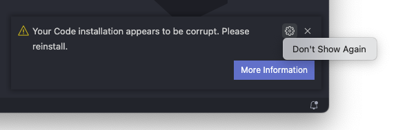

# Custom Pointer

This extension updates the VS Code styles to change the hand cursor to a normal pointer.

> If you're using **Windows**, _Visual Studio Code_ must be running as an administrator in order for this extension to be able to add the new css styles.

## Install
Follow the instructions in the Marketplace, or run the following in the command palette:

ext install diegocurbelo.custom-pointer

## Usage
The extension will be enabled by default. And can be enabled or disabled with the following commands:

> You can open the Command Palette with `Shift+CMD+P`

* `Custom Pointer: Enable`: enable the extension

* `Custom Pointer: Disable`: disable the extension

## Important Notice
As the description says, this extension overrides the editor CSS styles to use `cursor:default` instead of `cursor:pointer` throughout the UI.

To achieve this it adds new styles at the end of the file `workbench.desktop.main.css`; and modifying this file causes the editor to detect the installation as corrupt and display a warning notification (that can be hidden by selecting "Don't Show Again').

_NOTE_: Disabling the extension removes the custom CSS styles, and after  restarting the editor the notification is no longer displayed, there is no need to reinstall VS Code.